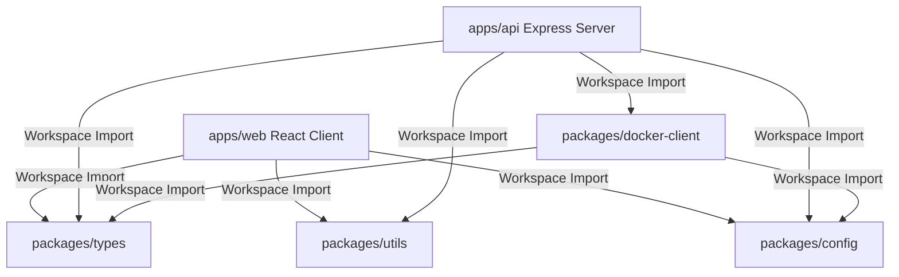
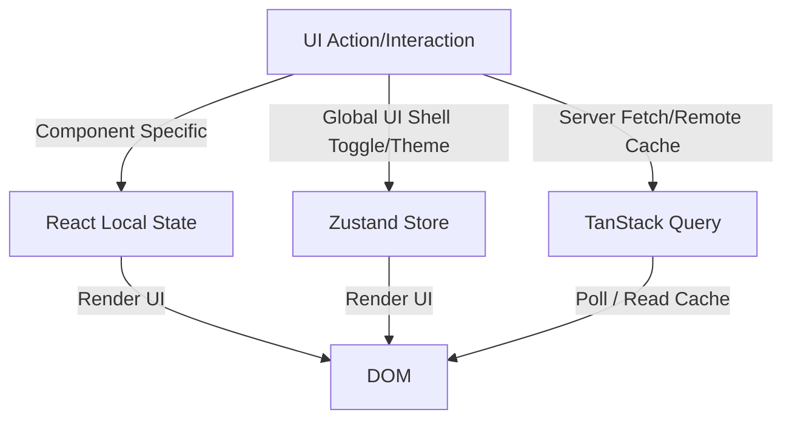
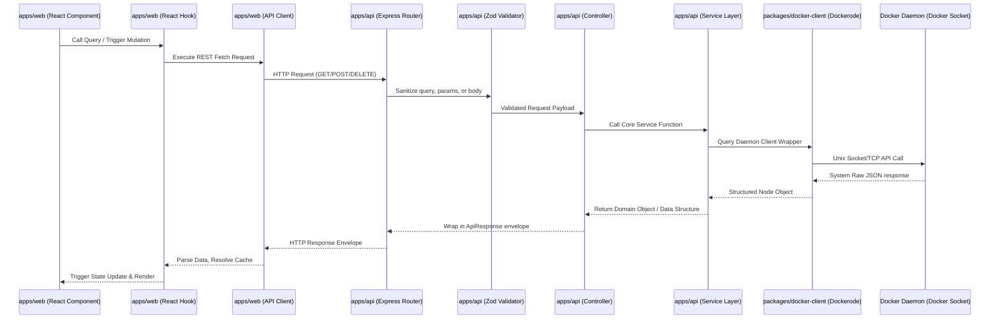

# DockVerse Project Constitution
## Enterprise Engineering Handbook (Architecture Freeze v1.0)

---

### 1. Document Control & Purpose
This Constitution serves as the definitive engineering handbook, architectural reference, and governance charter for the **DockVerse** project. All software engineers, DevOps practitioners, QA leads, technical writers, and AI coding agents operating on this codebase must adhere strictly to these mandates. 

The core mission of DockVerse is to deliver a robust, clean-architecture, developer-centric monorepo dashboard for container management, image manipulation, virtual networks, and volume orchestration. This document guarantees structural uniformity, high performance, and backward compatibility as the project scales from Phase 2 through Phase 18.

---

### 2. Monorepo & Folder Architecture
DockVerse is structured as an npm-workspace monorepo to enforce strict package boundaries, separate layer concerns, and eliminate circular dependency matrices.

#### Workspace Folder Hierarchy
```text
dockverse/
├── apps/
│   ├── api/                     # Express API Server (NodeJS + TypeScript)
│   │   ├── dist/                # Compiled production JavaScript files
│   │   ├── src/
│   │   │   ├── config/          # App configuration, server setup, & loaders
│   │   │   │   └── index.ts     # Config schema resolution and environment loading
│   │   │   ├── controllers/     # Route-specific HTTP presentation controllers
│   │   │   ├── docker/          # Docker core domain service layer
│   │   │   │   └── docker.service.ts # Core business logic interacting with docker-client
│   │   │   ├── middleware/      # Global middleware (CORS, errors, logging, security)
│   │   │   ├── routes/          # Express route declarations (v1 routing mapping)
│   │   │   ├── services/        # Service declarations for non-Docker domains (e.g. database, monitoring)
│   │   │   ├── utils/           # Utility functions (logger.ts, errors.ts)
│   │   │   ├── validators/      # Zod validation schemas for incoming requests
│   │   │   └── server.ts        # Bootstrap script (initializes listeners, connects database)
│   │   ├── tsconfig.json        # TypeScript configuration for API
│   │   └── package.json         # API specific configuration and dependencies
│   │
│   └── web/                     # React Single-Page Application (Vite + TS)
│       ├── src/
│       │   ├── api/             # API request wrappers (TanStack Query integrations)
│       │   ├── app/             # Application shell, routing configuration, global providers
│       │   ├── assets/          # Static media, icons, and graphic items
│       │   ├── components/      # Global reusable UI components (Buttons, Modals, Forms)
│       │   ├── hooks/           # Reusable stateful hooks (useDockerTelemetry)
│       │   ├── lib/             # Third-party configurations (axios, queryClient, charts)
│       │   ├── pages/           # High-level route views (Dashboard, Containers, Settings)
│       │   ├── store/           # Zustand global state stores (uiStore.ts)
│       │   ├── styles/          # Vanilla CSS modules and design system tokens
│       │   ├── App.tsx          # Root React node
│       │   ├── main.tsx         # DOM entrypoint
│       │   └── index.css        # Core global CSS variables and base rules
│       ├── tsconfig.json        # TypeScript configuration for Web
│       └── package.json         # Web specific configuration and dependencies
│
├── packages/                    # Internal shared workspace packages
│   ├── config/                  # Zod validation schemas for environment variables
│   │   └── src/index.ts         # Parsed configuration configurations exports
│   ├── docker-client/           # Dockerode runtime client wrappers
│   │   └── src/index.ts         # Dockerode initialization and export functions
│   ├── types/                   # Unified TypeScript schemas and entities
│   │   └── src/index.ts         # Shared API requests and response interfaces
│   └── utils/                   # Shareable utilities (formatting, mathematics)
│       └── src/index.ts         # Helper exports (byte formats, elapsed durations)
│
├── docs/                        # Complete technical and architectural records
│   ├── adr/                     # Architectural Decision Records
│   │   └── ADR-001-REST-First-Architecture.md
│   ├── roadmap/                 # Engineering specifications per phase (e.g. phase-02-containers.md)
│   ├── reports/                 # Audit results compiled at the end of each phase
│   ├── api.md                   # REST Endpoint specification documentation
│   ├── architecture.md          # Visual architecture definitions
│   ├── development.md           # Local setup instructions
│   ├── project-structure.md     # Directory structural reference
│   └── technical-debt.md        # Monitored code smells and deferred tasks
│
├── tests/                       # Global integration, performance and mock suites
├── scripts/                     # Maintenance, migration, and automation tasks
├── package.json                 # Monorepo workspaces manifest
└── tsconfig.json                # Root configurations
```

#### Directory Responsibilities
- **`apps/api/src/controllers`**: Exclusively maps incoming HTTP requests to backend services. Controllers must remain thin, delegating validation to middleware and business logic to services.
- **`apps/api/src/services`**: Contains all business logic. Controllers never access repositories or Docker clients directly.
- **`apps/api/src/validators`**: Contains Zod validation schemas that sanitize and check request payloads (body, query parameters, route variables) before controllers process them.
- **`apps/web/src/api`**: Consolidates API client functions and wrappers. Every function must map to the unified types package.
- **`packages/*`**: Decoupled, reusable packages imported as local monorepo references. Helps establish clean boundaries.

#### Folder & File Naming Conventions
- **Directory Names**: Use kebab-case for all directories (e.g., `docker-client`, `ui-components`).
- **React Components**: Use PascalCase (e.g., `StatusCard.tsx`, `SidebarNavigation.tsx`).
- **Hooks**: Use camelCase prefixed with `use` (e.g., `useDockerTelemetry.ts`).
- **Backend Handlers**: Use dot-separated names matching roles (e.g., `docker.controller.ts`, `docker.service.ts`).
- **Utilities and Helpers**: Use camelCase (e.g., `byteFormatter.ts`).

---

### 3. Dependency Management & Package Boundary Policy
To prevent circular dependencies and structural leakage across workspaces, dependency mapping must conform to strict directionality standards.



#### Allowed Dependency Directions
1. **Frontend to Packages**: `apps/web` is allowed to depend on `packages/types`, `packages/utils`, and `packages/config`. It is **strictly prohibited** from depending on `packages/docker-client` or any module under `apps/api`.
2. **Backend to Packages**: `apps/api` depends on `packages/types`, `packages/utils`, `packages/config`, and `packages/docker-client`. It must never reference `apps/web` source files.
3. **Workspace Package isolation**: Shared packages under `packages/*` must remain independent of framework-specific runtimes (like Express or React). They cannot import modules from application packages (`apps/api` or `apps/web`).
4. **Internal Versioning**: Internal packages are referenced via npm workspace links (`"workspace:*"`). Package versions are locked globally in the root `package.json` to prevent divergence.
5. **No Circular Dependencies**: Circular dependencies (e.g., `packages/types` depending on `packages/utils` while `packages/utils` imports from `packages/types`) are strictly forbidden and will fail build gates.

---

### 4. React State Management Strategy
Frontend state must be separated into three distinct domains to prevent rendering loops, cache invalidation issues, and duplicate remote calls.



#### State Roles & Approved Libraries
1. **React Local State (`useState`, `useReducer`)**
   - **Responsibility**: UI state that is isolated to a single component or its direct children.
   - **Approved Cases**: Tab selections, dropdown toggle states, local search inputs, form drafts, modal open states.
   - **Rule**: Never hoist local state to Zustand unless remote, non-child components must act on it.

2. **Zustand (`store/uiStore.ts`)**
   - **Responsibility**: Global UI state that needs to persist across navigation but does not map to database records.
   - **Approved Cases**: Sidebar collapsed/expanded state, light/dark theme preference, global toast/notification arrays, active workspace ID.
   - **Rule**: Zustand is the **only** approved global client state manager. Do not use React Context for global state management to prevent unnecessary component tree updates. Do not duplicate server data in Zustand.

3. **TanStack Query (React Query)**
   - **Responsibility**: Remote server state (fetching, caching, mutations, synchronization, and automatic updates).
   - **Approved Cases**: Lists of containers, Docker system information, networks, volumes, image files, performance metrics.
   - **Rule**: TanStack Query is the **only** approved server-state manager. All API requests must flow through TanStack Query hooks.
   - **Polling Requirement**: Telemetry polling is achieved using `refetchInterval`. WebSockets are disabled for Phases 1-10.

---

### 5. Architectural Request Flow
Every request in the DockVerse application must follow a strict, unidirectional execution lifecycle.



#### Lifecycle Step Rules:
1. **Frontend Trigger**: React views trigger query hook requests or dispatch mutate events.
2. **REST Execution**: The API client wrapper (under `apps/web/src/api`) handles network routing and translates backend errors.
3. **Endpoint Validation**: The API server routes requests through Express middleware. Zod schemas validate the request body, path params, and query strings. If invalid, the server immediately returns a `400 Bad Request`.
4. **Thin Controller**: The controller extracts the validated parameters and routes the workload directly to the service layer.
5. **Business Service**: The service executes logical processing, applies business rules, interacts with databases, or utilizes the shared `docker-client` wrapper.
6. **Docker Engine**: The `docker-client` package executes requests against the local Docker Daemon socket.
7. **Unified Response**: The controller intercepts the service output and wraps it in a standard `ApiResponse<T>` envelope.

---

### 6. Feature Module Standard
All future modules—including `Workspace`, `Containers`, `Images`, `Networks`, `Volumes`, `Dockerfiles`, `Compose`, `Registry`, `Monitoring`, `AI`, `Settings`, and `Authentication`—must utilize a standardized, modular structure.

#### Directory Layout for Feature Modules

##### Frontend Modular Sub-folder (`apps/web/src/features/<feature-name>`)
To keep features self-contained:
```text
features/<feature-name>/
├── api/             # Specific API endpoints and TanStack Query hooks
├── components/      # UI components used only inside this feature
├── hooks/           # Stateful hooks specific to this domain
├── pages/           # High-level route pages
└── utils/           # Helper utilities unique to the feature
```

##### Backend Modular Sub-folder (`apps/api/src/<feature-name>`)
```text
<feature-name>/
├── <feature-name>.controller.ts  # Route action handlers
├── <feature-name>.service.ts     # Core domain business logic
├── <feature-name>.router.ts      # Endpoint mounting path declarations
└── validators/                   # Specific Zod request validation schemas
```

#### Feature Isolation Guardrails
- **Isolation Constraint**: Features must not import components, hooks, or assets from other feature modules directly. Common layout elements or shared types must reside in global directories (`apps/web/src/components` or `packages/types`).
- **Service-Only Communication**: Backend cross-feature communication must happen strictly via services, never by calling controllers of another feature.

---

### 7. Configuration Governance Policy
To prevent runtime configuration drift and undefined execution environments, configurations must be handled deterministically.

1. **Precedence Rules**: 
   - Environment Variables (e.g., `.env`) override default fallback options.
   - CLI flags during initialization take absolute precedence over file-based options.
   - Runtime configuration options from the database are used only for user profile settings, never for system or daemon configurations.
2. **Immutable Loading**: Configurations must be loaded, validated using Zod, and frozen (`Object.freeze`) during server bootstrap. Any attempt to modify a configuration value at runtime will trigger an application crash.
3. **No Direct `process.env` access**: Raw environment variables must never be accessed outside `packages/config` or `apps/api/src/config/index.ts`. All modules must import the typed configuration object.

---

### 8. REST API Stability & Versioning Policy
Public API interfaces are locked and must support backward compatibility.

1. **API Versioning**: All REST endpoints must route through `/api/v1`. If breaking changes are required, a new `/api/v2` route namespace will run concurrently.
2. **Backward Compatibility**: Existing properties in the response envelope or data objects cannot be renamed or removed. Only additive attributes are permitted within a minor/patch phase.
3. **Deprecation Strategy**: 
   - Deprecated endpoints must return a `Warning` HTTP header with a deprecation timestamp.
   - Deprecated endpoints must be tracked in `docs/technical-debt.md` and remain functional for at least two complete implementation phases before removal.

---

### 9. Database Governance Policy
DockVerse metadata (such as custom container groups, workspace settings, labels, and auditing logs) are stored in MongoDB. The runtime state of the containers remains inside Docker Engine.

1. **Separation of Concerns**: Under no circumstances should Docker container status, network details, or active volumes be cached or mirrored in MongoDB. Docker Engine remains the single source of truth for runtime states.
2. **Schema Migrations**: Schema alterations must use automated migration scripts (e.g., using `migrate-mongo` or similar) tracked in the source control (`scripts/migrations/`). Direct manual database changes are strictly forbidden.
3. **Index Governance**:
   - Indexes must be defined explicitly in the schema validation code.
   - Every collection must have query-optimized indexes. Name indexes using the `<collection_name>_<fields>_idx` structure.
4. **Transactions**: Use MongoDB Sessions and transactions when modifying multiple related metadata documents (e.g., workspaces and workspace membership changes).

---

### 10. Security Governance
All application layers must be hardened to prevent privilege escalation or container escape via host socket exposure.

1. **Docker Socket Isolation**: The Docker socket (`/var/run/docker.sock` or `npipe://`) must run with restricted permissions. The API backend must run as a specialized user group, never as root.
2. **Express Security Hardening**:
   - Helmet middleware must be enabled with strict content security policy settings.
   - CORS must be restricted to explicitly defined origins loaded from configuration.
   - Express rate limiters must restrict requests to `100` requests per minute per IP for standard endpoints, and `10` requests per minute per IP for administrative/destructive operations.
3. **Payload Sanitization**:
   - All inputs (including headers, query parameters, route variables) must undergo strict validation through Zod before processing.
   - Command injection prevention: Avoid executing shell utilities (`child_process.exec`). Use the typed Dockerode SDK wrapper instead.
4. **Error Handling**: Sensitive execution paths, database traces, or raw Docker Engine trace exceptions must be filtered. The error envelope must only expose sanitized developer messages.

---

### 11. Caching & State Synchronization Policy
Data caching must be managed systematically to prevent out-of-sync dashboards or corrupted states.

1. **Cache Ownership**: TanStack Query owns all server cache states. Direct manual caching via memory registers or localStorage for server data is prohibited.
2. **Cache Expiry (Stale Times)**: 
   - Dashboard telemetry: `staleTime: 5000` (5 seconds).
   - Resource Lists (containers, networks, volumes): `staleTime: 10000` (10 seconds).
   - Static/Configuration properties: `staleTime: 60000` (60 seconds).
3. **Automatic Invalidation**: Tiggering a mutation (e.g. starting a container or deleting a volume) must immediately invalidate the corresponding query keys (`queryClient.invalidateQueries({ queryKey: [...] })`) to trigger automatic background synchronization.

---

### 12. Enterprise Logging & Observability
System logs must remain structured, machine-readable, and searchable.

1. **Structured Log Structure**: All logs must write to standard output in JSON format (using `pino` or similar logger).
2. **Core Metadata Fields**: Every log entry must include:
   - `timestamp` (ISO 8601 UTC)
   - `level` (debug, info, warn, error, fatal)
   - `correlationId` (UUID passed via middleware from the client)
   - `context` (class or module name)
3. **Sensitive Data Redaction**: Log formatters must mask sensitive information such as access keys, authentication tokens, system passwords, and Docker Registry credentials before writing to output.
4. **Audit Logs**: Administrative operations (such as container deletion, image building, and configuration updates) must write to a dedicated secure audit collection in MongoDB.

---

### 13. Performance Budget
DockVerse operations must remain fast and resource-efficient.

1. **Target API Latency**:
   - Read queries (non-aggregating): `< 50ms`.
   - Aggregated dashboard statistics: `< 150ms`.
   - Mutative actions (excluding image pull/build): `< 200ms`.
2. **Frontend Bundle Sizes**: The production React bundle (Vite build) must remain under `250KB` (gzipped). Route-based code splitting is mandatory.
3. **Virtualization**: Collections of resources (e.g., container listings, log feeds) rendering more than 100 entries must use virtualization libraries (e.g., `@tanstack/react-virtual`) to limit DOM nodes.

---

### 14. Accessibility (a11y) Governance
DockVerse must remain fully accessible to all developers.

1. **Keyboard Navigation**: All interactive elements (buttons, inputs, toggle switches, tabs) must be focusable using standard keyboard controls (`Tab`, `Shift+Tab`, `Space`, `Enter`).
2. **Focus Management**: Active modal dialogues must trap focus and return focus to the trigger element upon closing. 
3. **Screen Reader Compliance**: Use semantic HTML tags. Explicit `aria-label` or `aria-describedby` tags are required for icon-only buttons or interactive status cards.
4. **Contrast Ratio**: The user interface contrast ratio must meet WCAG 2.1 AA requirements (minimum 4.5:1 for normal text).

---

### 15. Testing Strategy & Quality Gates
All code contributions must undergo validation testing before merge.

```text
▲
├── [E2E Tests]        (Playwright - Critical Flows - 10% coverage)
├── [Integration/API] (Supertest - Controller -> DB/Daemon - 30% coverage)
└── [Unit/Component]  (Vitest - Business logic, isolated elements - 60% coverage)
```

1. **Testing Pyramid**:
   - **Unit Tests**: Focus on utility calculations, validator configurations, and isolated hooks.
   - **Integration/API Tests**: Verify Express routes, Zod schemas, and services using mock Docker Engine states.
   - **E2E Tests**: Verify cross-browser layout integration, login sequences, and status changes.
2. **Mocking Rule**: Real Docker Daemon interaction is prohibited during automated unit testing. Mock clients are required under `tests/mocks/`.
3. **Quality Gate Thresholds**:
   - Minimum branch coverage: `80%` in shared libraries and services.
   - Zero linter warning tolerance.

---

### 16. Code Quality & Standards
Maintain clean, readable, and consistent TypeScript code.

1. **TypeScript Constraints**: Strict mode is enabled (`strict: true`). Unsafe `any` is strictly prohibited; if a type is unknown, use `unknown`.
2. **Complexity Thresholds**:
   - Maximum function length: `40 lines`.
   - Maximum file size: `250 lines` (excluding test files).
   - Cyclomatic complexity per function must remain under `10`.
3. **Comments and JSDoc**: Exported modules, classes, and helper functions must include clear JSDoc blocks explaining arguments and return values.

---

### 17. Disaster Recovery & Failure Handling Policy
DockVerse must degrade gracefully when underlying services are unavailable.

1. **Docker Daemon Offline fallback**: If the Docker Daemon socket is unreachable, the system must return `503 Service Unavailable` with a structured payload. The frontend must display a global warning bar and redirect the user to a connection settings configuration pane, keeping the UI functional.
2. **Database Offline fallback**: If MongoDB is unreachable, caching and workspace configurations are disabled, but container view-only management (which relies directly on the Docker socket) must remain accessible.
3. **Circuit Breakers**: Introduce circuit-breaker structures for remote calls (e.g., pulling images from a registry) to prevent backend process crashes when registries are offline.

---

### 18. CI/CD Governance & Gates
No pull requests can merge without passing these automated pipeline checks:

1. **Phase 1: Static Analysis**: Code compilation via `tsc --noEmit` and formatting compliance checks via ESLint/Prettier.
2. **Phase 2: Vulnerability Audit**: Security audits of npm dependencies (`npm audit --audit-level=high`).
3. **Phase 3: Test Execution**: Completion of unit, integration, and mocking suites.
4. **Phase 4: Build Verification**: Successful construction of production bundles (`npm run build`).
5. **Phase 5: Audit Report Generation**: Validation that a phase audit report exists under `docs/reports/` before finalizing the release branch.

---

### 19. Roadmap Integration & Phase Gates
The DockVerse roadmap spans Phase 2 through Phase 18. Each phase is structured around modular extensions.

1. **Requirements Specifications**: Each phase requires a dedicated roadmap file at `docs/roadmap/phase-XX-<feature>.md`.
2. **Phase Acceptance Gate**: To freeze a phase and move to the next, the following criteria must be met:
   - Successful production build.
   - Zero TypeScript compiler errors.
   - Zero ESLint/Prettier warnings.
   - Automated tests pass successfully.
   - Documentation, including API endpoints and roadmap status, is updated.
   - Phase audit report compiled under `docs/reports/`.

---

### 20. AI Coding Agent Policy
All AI agents modifying this codebase must adhere to the following rules:

1. **Inspect First**: Read this Project Constitution and the relevant Phase Roadmap specification before starting any task.
2. **No Duplication**: Re-use existing components, hooks, validators, utilities, and interfaces. Writing duplicate files or structures is prohibited.
3. **Minimal Code Footprint**: Make only the requested changes within the feature scope. Avoid speculative refactoring.
4. **Maintain Isolation**: Do not scatter code across features. Keep code confined to the target feature directories.
5. **Backward Compatibility**: Do not modify existing API structures, schemas, or frozen layers.

---

### 21. Forbidden Practices
To maintain code cleanliness, the following practices are strictly forbidden:
- **Direct Daemon Access**: Frontend pages or components must never import packages/docker-client or execute Docker commands directly.
- **Direct Database Access**: Backend controllers must never query databases directly; all database requests must go through the appropriate service layer.
- **State Duplication**: Storing server data (like container lists) in Zustand stores instead of the React Query cache.
- **Silencing Errors**: Empty catch blocks or using `any` to bypass TypeScript rules.
- **Leftover Code**: Unused imports, commented-out code blocks, or debug log statements in production commits.
- **TODOs without Tracking**: Committing code with generic `// TODO` comments that lack documentation.

---
