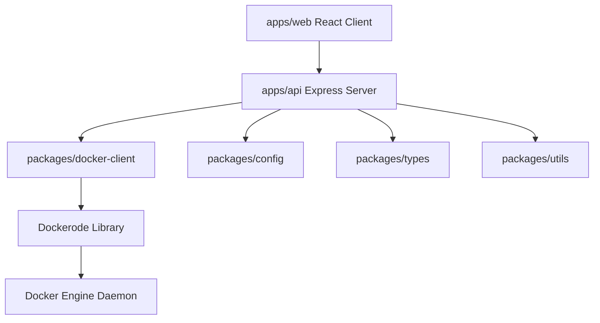

# DockVerse Clean Architecture

DockVerse is structured as a clean-architecture monorepo, decoupling business services, platform clients, and API layers from frontend presentations.

## System Layers

### 1. Presentation Layer (`apps/web`)
A single-page React app bundled with Vite.
- **State Management**: Zustand manages UI actions, theme toggles, and layout collapses.
- **Server Cache**: TanStack Query manages HTTP/REST endpoints, caching dashboard responses, and providing a 5-second polling refresh.
- **REST Telemetry Polling**: Queries the backend daemon periodically via HTTP to get stats. WebSockets are intentionally excluded from Phase 1 through Phase 10 because they are unnecessary for the current product goals.

### 2. Controller & Routing Layer (`apps/api`)
Express server exposing versioned REST endpoints under `/api/v1`.
- **REST Endpoints**: Decouples network presentation schemas from services.

### 3. Service Layer (`apps/api/src/docker/docker.service.ts`)
Contains the application business logic for interfacing with Dockerode. Controllers never interact with Dockerode directly.

### 4. Shared Packages (`packages/*`)
Decoupled modules imported as workspace references:
- `types`: Uniform interfaces for REST payloads.
- `utils`: Generic formatting utilities (bytes, duration).
- `config`: Environment validation schema powered by Zod.
- `docker-client`: Platform-specific Dockerode instance initializer.
